# 🏛️ Awesome Architecture Decision Records (ADR) Platform Ecosystem

       

> 🚀 **Curated List of SaaS Platforms & Open-Source GitHub Projects** for capturing, versioning, searching, and visualizing **Architecture Decision Records (ADRs)** across engineering teams and enterprise software architectures.

---

## 📌 Overview & Value Proposition

**Architecture Decision Records (ADRs)** document significant architectural choices, context, status, and rationale in a version-controlled, searchable format. By formalizing technical decisions alongside codebase changes, engineering organizations eliminate institutional knowledge loss and maintain architectural governance across distributed development teams.

---

## 📑 Table of Contents

- [☁️ SaaS & Hosted Platforms](#️-saas--hosted-platforms)
- [📦 Open-Source GitHub Repositories](#-open-source-github-repositories)
- [🛠️ Key Frameworks & Standards](#️-key-frameworks--standards)
- [🤝 How to Contribute](#-how-to-contribute)
- [⚠️ Disclaimer](#️-disclaimer)
- [💖 Support & Sponsorship](#-support--sponsorship)
- [📈 Star History](#-star-history)

---

## ☁️ SaaS & Hosted Platforms

> 📊 **Market Size & Structure Analysis**: The global Enterprise Architecture & Technical Documentation software sector is estimated at **$1.5 Billion (2026)**, projected to reach **$2.8 Billion by 2030** (CAGR ~13.2%). The market is **moderately fragmented**, bridging enterprise-wide governance suites with developer-first lightweight ADR platforms.

The following commercial SaaS solutions provide managed hosting, interactive C4/diagram mapping, collaborative review workflows, and portfolio governance:

| Product / Platform 🚀 | Company Size (Valuation / Revenue) 🏢 | Starting Pricing 💰 | Free Tier / Trial Limit 🎁 | Key Architecture Capabilities 🛠️ |
| :--- | :--- | :--- | :--- | :--- |
| **[SAP LeanIX](https://www.leanix.net/)** | ~$1.2 Billion *(Acquired by SAP)* | $500/month *(Billed annually)* | 14-day free trial *(Full enterprise sandbox access)* | Enterprise architecture management suite connecting ADRs with application portfolios, compliance, and capability mapping. |
| **[Ardoq](https://www.ardoq.com/)** | ~$300 Million *(Series B Valuation)* | $833/month *($10,000/yr starting tier)* | 14-day free trial *(Up to 5 team members with demo datasets)* | Graph-based enterprise architecture platform with automated decision modeling and dynamic visualization. |
| **[Swimm](https://swimm.io/)** | ~$80 Million *(Series A Valuation)* | $16/user/month *(Standard tier)* | Free forever *(Up to 5 users & unlimited public repos)* | Code-coupled documentation platform integrating living ADRs directly into IDEs and GitHub pull request workflows. |
| **[Enterprise Architect](https://sparxsystems.com/)** | ~$50 Million *(Annual Revenue)* | $249 one-time/user *(Standard Edition)* | 30-day free trial *(Unrestricted full desktop feature access)* | Comprehensive UML & enterprise architecture modeling suite with decision tracking and requirements traceability. |
| **[IcePanel](https://icepanel.io/)** | ~$15 Million *(Seed Valuation)* | $15/user/month *(Pro tier)* | Free forever *(Up to 3 users & 1 landscape model)* | Interactive C4 model architecture tool designed for agile teams to capture domain decisions and visual system flows. |
| **[Structurizr Cloud](https://structurizr.com/)** | ~$5 Million *(Bootstrapped Valuation)* | $7/month *(Standard workspace)* | Free forever *(1 workspace limit, up to 3 diagrams)* | SaaS diagramming & architecture modeling platform built on C4 model DSL with native markdown decision record hosting. |

---

## 📦 Open-Source GitHub Repositories

Below is a curated selection of leading **Open-Source GitHub projects** for creating, rendering, indexing, and maintaining ADRs, sorted by GitHub star count:

1. **[Backstage ADR Plugin](https://github.com/backstage/backstage)**   
   *Official Spotify Backstage developer portal plugin for discovering, rendering, and indexing Markdown architectural decision records.*

2. **[adr-tools](https://github.com/npryce/adr-tools)**   
   *The classic open-source command-line tool for managing Architecture Decision Records in Nygard format within Git repositories.*

3. **[MADR (Markdown Architectural Decision Records)](https://github.com/adr/madr)**   
   *Lean, structured Markdown templates and specification format for documenting decisions with context, options, and consequences.*

4. **[Log4brains](https://github.com/thomvaill/log4brains)**   
   *Open-source static site generator and CLI tool to document, search, and visualize architecture decisions with a modern web UI.*

5. **[Structurizr CLI](https://github.com/structurizr/cli)**   
   *Command-line utility for Structurizr DSL to export C4 architecture diagrams and render embedded decision records.*

6. **[Phodal ADR](https://github.com/phodal/adr)**   
   *Lightweight cross-platform architecture decision record tool supporting multiple languages and Markdown formats.*

7. **[adr-viewer](https://github.com/mrwilson/adr-viewer)**   
   *Python tool to parse a directory of Markdown ADRs and generate a clean static HTML documentation site.*

8. **[adrs (Rust CLI)](https://github.com/joshrotenberg/adrs)**   
   *Fast Rust-based port of adr-tools featuring enhanced searching, tag indexing, and automated template generation.*

9. **[adr-log](https://github.com/adr/adr-log)**   
   *Command-line tool to generate a table of contents and index log from a collection of Markdown ADR files.*

---

## 🛠️ Key Frameworks & Standards

- **CLI Management**: Use `adr-tools` or `adrs` for local CLI creation.
- **Record Standard**: Adopt `MADR` or `Michael Nygard format` for consistent structure.
- **Developer Portals**: Integrate with `Backstage ADR plugin` or publish via `Log4brains`.
- **Architecture Diagram Integration**: Combine with `Structurizr C4 DSL` for code-backed architecture models.

---

## 🤝 How to Contribute

Contributions are highly welcomed! Follow these simple steps:

1. Fork this repository.
2. Add your SaaS product or open-source tool following existing table/list formats.
3. Ensure exact pricing, trial limits, star count links, and valuation details are included.
4. Open a Pull Request detailing your changes.

Check out our curated ecosystem lists at [Awesome-Awesome-Awesome](https://github.com/ishandutta2007/Awesome-Awesome-Awesome)!

---

## ⚠️ Disclaimer

- This is a community-curated list maintained for educational and architectural reference.
- Product valuations, market share estimates, and pricing tiers reflect publicly disclosed 2026 data.

---

## 💖 Support & Sponsorship

Thank you for exploring and using the **Awesome Architecture Decision Records Platform** list! If this repository has helped your team standardize software architecture documentation:

- 🌟 **Star** this repository to increase visibility.
- 🔀 **Fork** it to maintain your team's internal tools list.
- 📢 **Share** with software architects and developer communities.
- ☕ **Buy me a coffee** and support future maintenance via the [GitHub Sponsor Dashboard](https://github.com/sponsors/ishandutta2007).

---

## 📈 Star History

